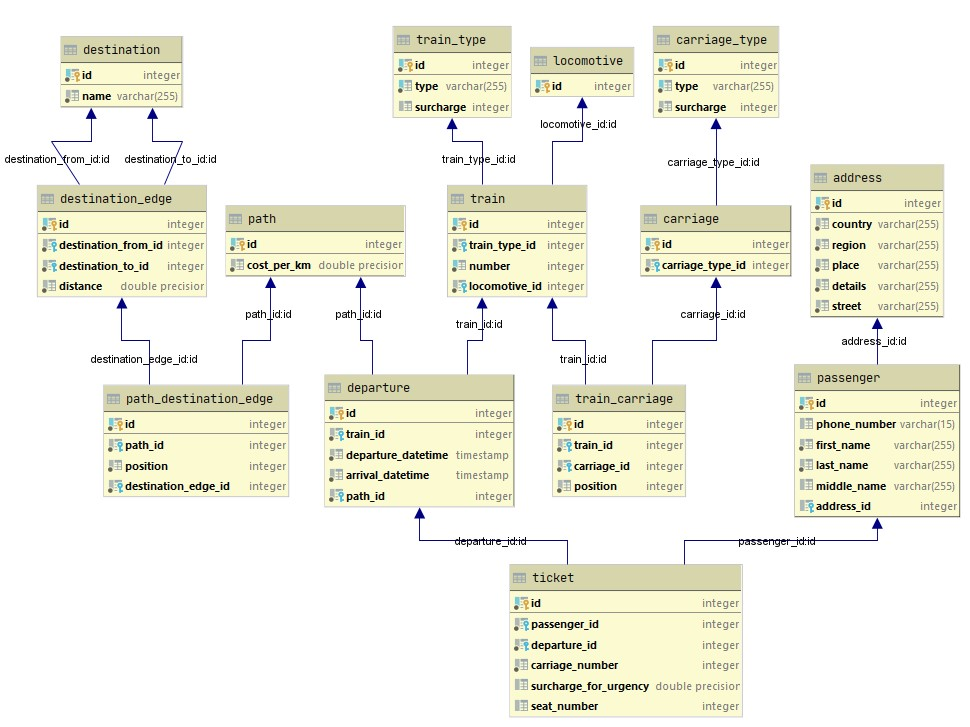

# Railways DB
Created using PostgreSQL.

## DB scheme:

[ERD (ru)](images/erd_db.jpg)

## Views:
+ [path_distance](database/views/path_distance.sql)
+ [ticket_all_info](database/views/ticket_all_info.sql)
+ [ticket_user_info](database/views/path_distance.sql)

## Functions and queries:
+ [get_departures_by_distance](database/functions/get_departures_by_distance.sql)
+ [get_passenger_tickets_in_currency](database/functions/get_passenger_tickets_in_currency.sql)
+ [get_passengers_by_address](database/functions/get_passengers_by_address.sql)
+ [get_passengers_by_name_in_range](database/functions/get_passengers_by_name_in_range.sql)
+ [get_average_cost](database/queries/get_average_cost.sql)
+ [get_lastname_with_initials](database/queries/get_lastname_with_initials.sql)
+ [get_passengers_lastnames_uppercased](database/queries/get_passengers_lastnames_uppercased.sql)
+ [get_total_ticket_costs_for_passengers](database/queries/get_total_ticket_costs_for_passengers.sql)
+ [get_user_orders_count](database/queries/get_user_orders_count.sql)
